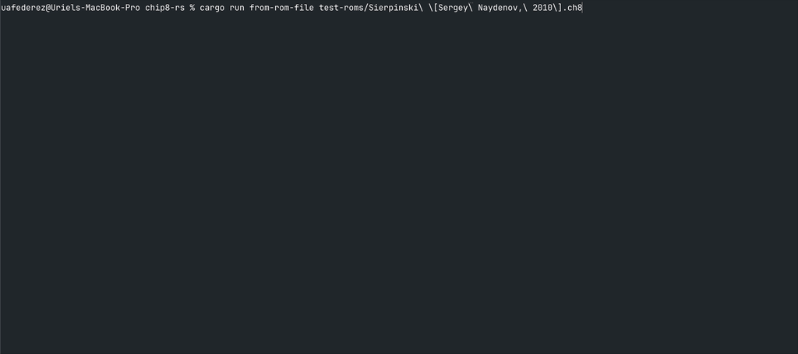

# Chip8 Interpreter

This is a re-implementation of a previous project that I worked on in order to learn Rust.

The GIF below shows the "Sierpinski Triangle" demo by Sergey Naydenov (2010) [chip-8-roms](https://github.com/kripod/chip8-roms). This is in progress since a lot of the instructions are not yet supported. The GIF also shows the performance with the FPS capped to a lower value just for inspection.



## Calling Convention

`V1` - return value
`V2` - 1st argument
`V3` - 2nd argument
...

## To Do

- [ ] High level language
  - [ ] Parser
  - [ ] Convert to "assembly"
  - [ ] Assembly to "bytecode"

## Grammar

Sample program to compute the n-th fibonnaci number

```plaintext
fn main(): void {
  let value: u8 = fibonacci(10);
  let another: u8 = value + 2;

  loop infinite {
    // this is an infinite loop
  };
}

fn fibonnaci(value: u8): u8 {
  if (value < 2) {
    return value;
  }
  return fibonnaci(value - 1) + fibonnaci(value - 2);
}
```

```plaintext
Program -> list of top level statements
Top level statement -> function declaration
function declaration -> "fn" <identifier>(<comma-separated parameter list>): type "{" <statements> "}"
parameter -> <identifier> ":" <type>
statement -> variable declaration | if statement | return statement
if statement -> "if" "(" <expression>  ")" "{" <statements > "}"
expression -> binary expression | function call | ...
...
```
